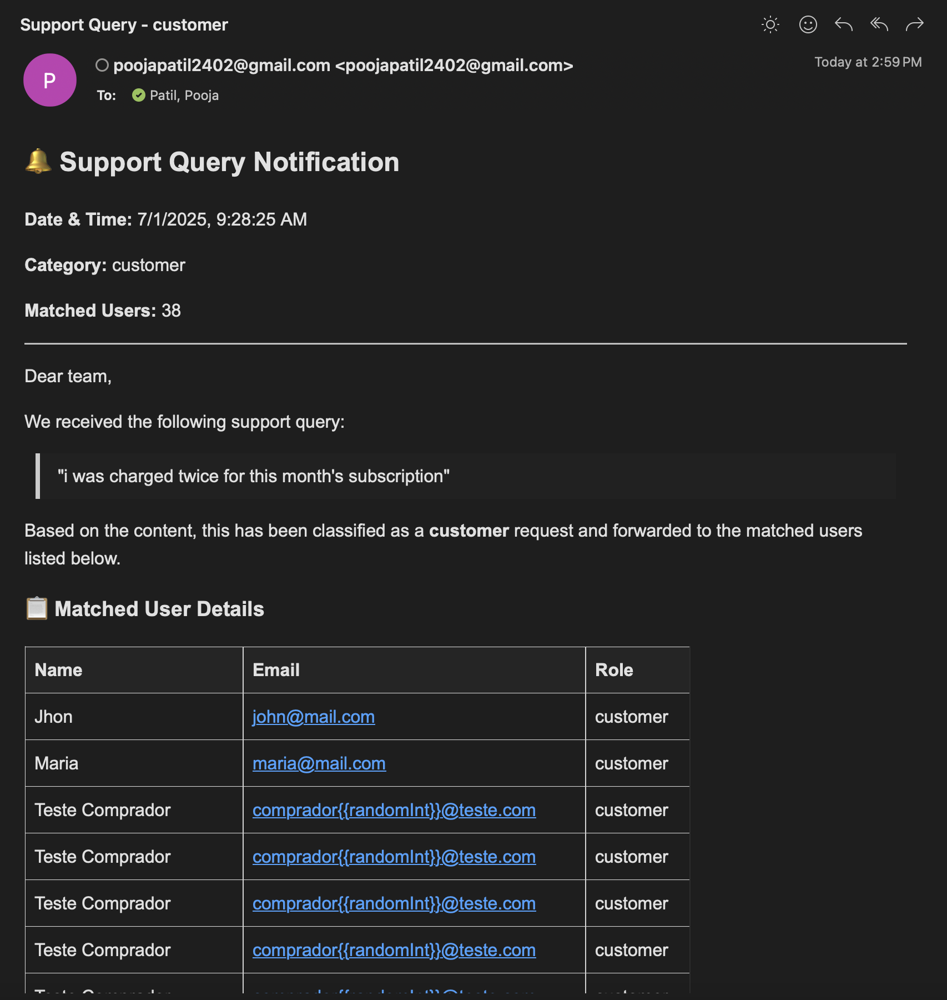
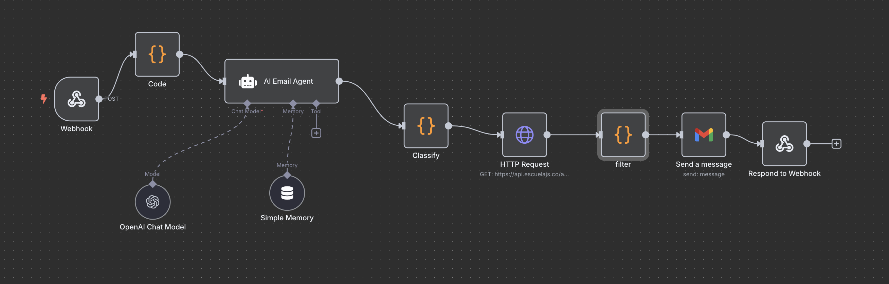

# 🤖 AI Email Automation Workflow using n8n

This project implements an AI-powered email automation system using [n8n](https://n8n.io). It classifies user queries using an LLM-powered agent, fetches and filters users from an external API, and sends a tailored email response via Gmail.

---

## 📌 Features

- 🔗 Webhook-triggered input via HTTP POST
- 🤖 AI Agent (LLM-based) to classify query intent
- 🌐 External API integration (fetch user data)
- 🔎 Filter logic to match users to the classified query
- 📤 Automated email sending via Gmail node
- 🔁 Webhook response summarizing the result

---

## 🗂️ Folder Structure

```
n8n-email-agent/
├── README.md
├── workflow/
│   ├── email-automation-workflow.json   # Exported n8n workflow
│   └── assets/
│       └── workflow-diagram.png         # Screenshot of the visual flow
|       └── email-screenshot.png  
├── scripts/
│   └── classify.js                      # Custom classification logic
│   └── filter.js                      # Custom filter logic
├── demo_video/
│   └── n8n Demo.mov                     # Working n8n agent demo
```

---

## 🚀 Getting Started

### 1. Clone the repository

```bash
git clone https://github.com/your-username/ai-email-agent-n8n-workflow.git
cd ai-email-agent-n8n-workflow
```

### 2. Import Workflow into n8n

1. Open your local or cloud-hosted n8n editor.
2. Go to **Workflows → Import**.
3. Upload the file:  
   `workflow/email-automation-workflow.json`

### 3. Setup Environment Variables

Create a `.env` file based on the provided sample:

```bash
cp config/env.sample .env
```

Update the values:

```env
OPENAI_API_KEY=your_openai_key
GMAIL_CLIENT_ID=your_gmail_oauth_client_id
GMAIL_CLIENT_SECRET=your_gmail_oauth_secret
API_BASE_URL=https://api.securelabs.co/api/users
```

### 4. Configure Gmail Credentials in n8n

1. Go to **Credentials → Gmail OAuth2 API**
2. Set your Client ID and Secret
3. Connect your Gmail account and authorize

---

## 🧠 Agent Architecture

> The system uses an **AI Agent** with memory and tools, powered by the OpenAI Chat Model.

**AI Agent Role:**
- Understands the incoming query
- Classifies it (e.g., *admin issue*, *product support*, *general inquiry*)
- Forwards classification to the filtering step

**Memory Node:**  
Stores conversation history (Simple Memory) to maintain context across turns.

**Tooling:**  
Custom code and filtering logic act as tools used by the agent to complete its task.

---

## 🔄 Workflow Overview

### 🔹 Steps:

1. **Webhook Trigger** – Accepts incoming user query via HTTP POST.
2. **AI Email Agent** – Uses OpenAI to classify the message.
3. **Classify (Code Node)** – Formats query and extracts category.
4. **HTTP Request** – Fetches user data from external API.
5. **Filter (Code Node)** – Filters users matching the query intent.
6. **Send a Message** – Sends structured email using Gmail node.
7. **Respond to Webhook** – Returns JSON result with status.

---

## 🧪 Sample Inputs & Outputs

### Example Webhook Input

```json
{
  "query": "I need help with my admin dashboard not loading"
}
```

### Classifier Output (AI Agent)

```json
{
  "category": "Admin Support"
}
```

### Filtered User Match (API)

```json
[
  {
    "name": "John Doe",
    "email": "john@company.com",
    "role": "Admin"
  }
]
```

### Email Sent

| Name     | Email             | Role  |
|----------|-------------------|-------|
| John Doe | john@company.com  | Admin |

---

## 📬 Sample email Screenshot



---

## 📸 Workflow Screenshot



---


## 👩‍💻 Author

**Pooja Patil**  
AI Email Workflow using n8n and OpenAI  